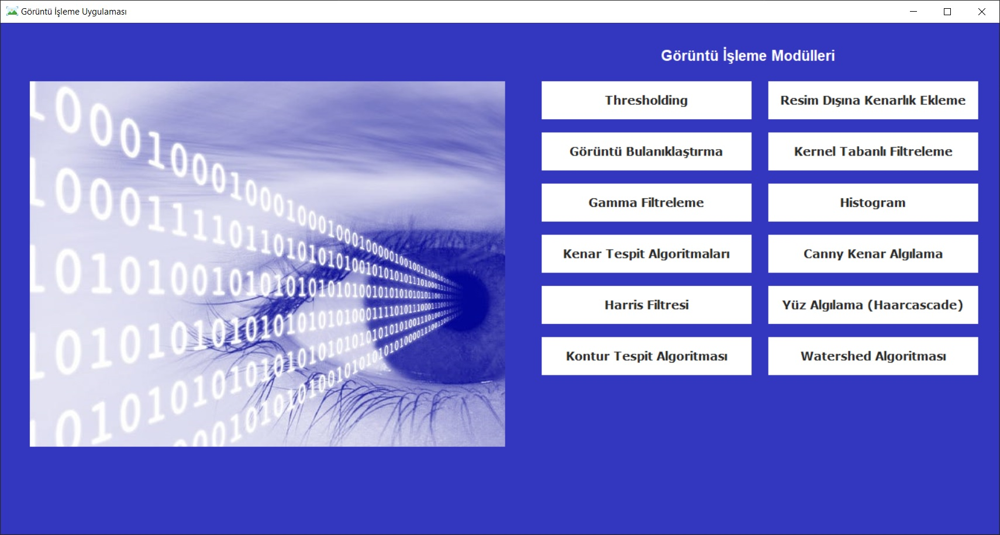
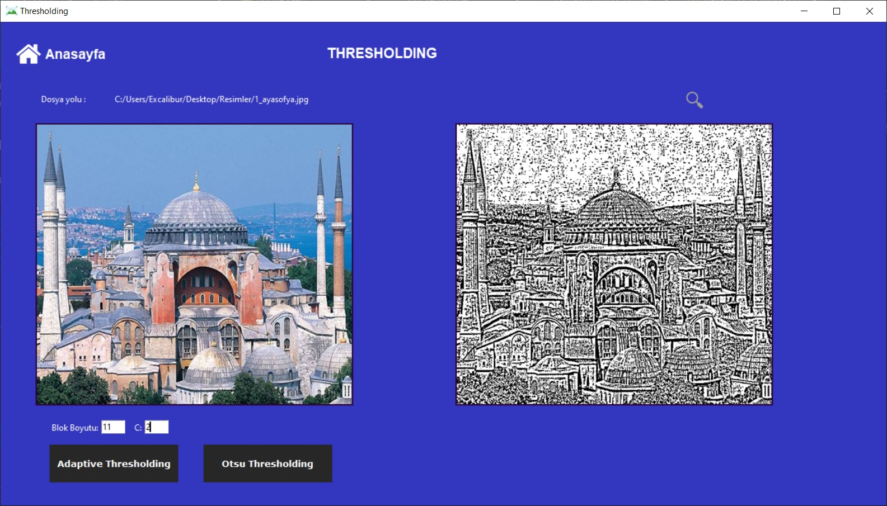
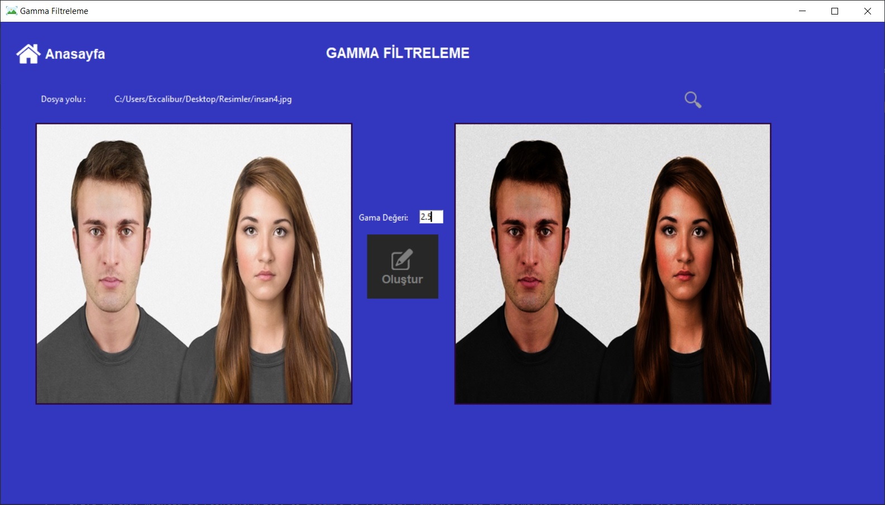
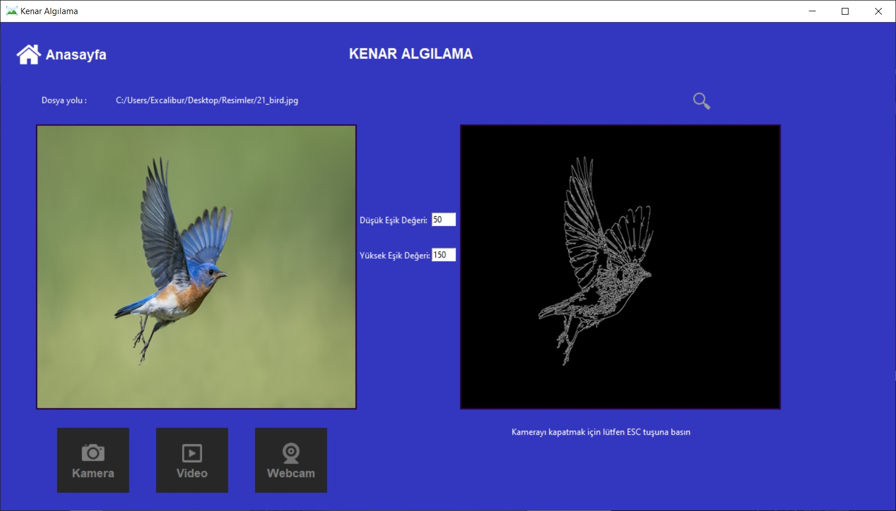
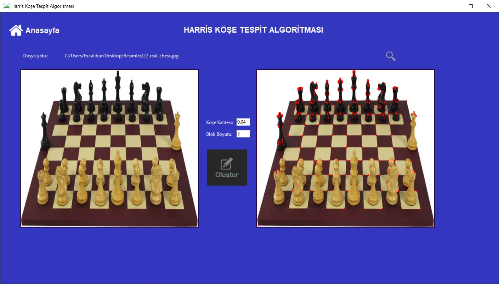
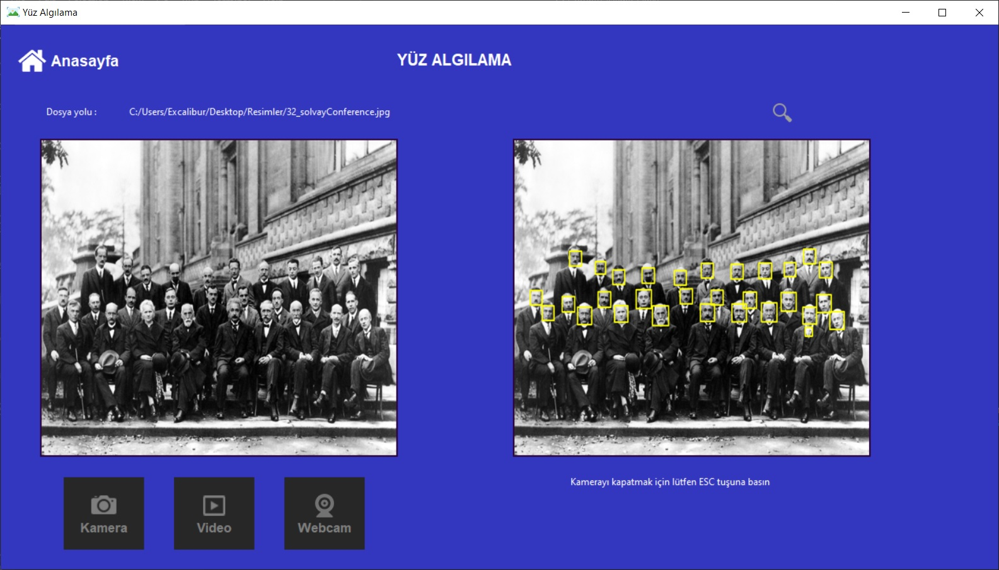

# Image-Processing-GUI
Bu Python tabanlı görüntü işleme uygulaması, kullanıcıya çeşitli görüntü işleme modüllerini keşfetme ve uygulama fırsatı sunan bir grafiksel kullanıcı arayüzü (GUI) içerir.

## Özellikler:
- Kullanıcı dostu arayüz: Ana menüden istediğiniz modülü seçerek kolayca kullanmaya başlayabilirsiniz.
- Çoklu modül desteği: Thresholding, kenarlık ekleme, bulanıklaştırma, filtreleme, kenar tespiti, yüz algılama, kontur tespiti ve Watershed algoritması gibi birçok modül mevcuttur.
- Resim ve webcam desteği: Bilgisayarınızdan resim yükleyebilir veya web kameranızdan canlı görüntü yakalayarak işlemlere uygulayabilirsiniz.

## Ana Menü
Ana menüde, kullanıcı aşağıdaki modüllere kolayca erişebilir:

- **Thresholding (Eşikleme):** Resimlerde belirli bir eşiği geçen pikselleri belirleme.
- **Resim Dışına Kenarlık Ekleme (CopyMakeBorder):** Resmin dışına belirli bir genişlikte kenarlık ekler.
- **Görüntü Bulanıklaştırma:** Blur, MedianBlur, BoxFilter, BilateralFilter, GaussianBlur gibi bulanıklaştırma yöntemleri.
- **Kernel Tabanlı Filtreleme:** Özel kernel tabanlı filtre uygulama.
- **Gamma Filtreleme:** Görüntünün parlaklığını ve kontrastını gamma değeri ile ayarlar.
- **Histogram:** Görüntünün histogramını çizme.
- **Kenar Tespit Algoritmaları:** SobelX, SobelY ve Laplacian gibi algoritmalarla görüntüdeki kenarları belirler.
- **Canny Kenar Algılama:** Canny kenar algılama yöntemi uygulama.
- **Harris Filtresi:** Harris filtresi ile görüntüdeki köşeleri tespit etme.
- **Yüz Algılama (Face Detection Haarcascade):** Haarcascade yöntemiyle yüz tespiti.
- **Kontur Tespit Algoritması:** Görüntüdeki konturları tespit etme.
- **Watershed Algoritması:** Görüntüdeki nesneleri birbirinden ayırmak için kullanılır.

## Uygulama Ekran Görüntüleri
<table>
  <tr>
    <td>1</td>
  <tr>
    <td></td> 
 </table>

<table>
  <tr>
    <td>2</td>
  <tr>
    <td></td>
 </table>

 <table>
  <tr>
    <td>3</td>
  <tr>
    <td></td>
 </table>

 <table>
  <tr>
    <td>4</td>
  <tr>
    <td></td>
 </table>

 <table>
  <tr>
    <td>5</td>
  <tr>
    <td></td>
 </table>

 <table>
  <tr>
    <td>6</td>
  <tr>
    <td></td>
 </table>

## Kullanım
1. Ana menüden istediğiniz modülü seçin.
2. Seçtiğiniz modülün özelliklerini ayarlayın veya varsayılan değerleri kullanın.
3. "Resim Yükle" düğmesiyle bir resim yükleyin veya "Webcam'i Aç" düğmesiyle kendi görüntünüzü kullanın.
4. İşleme tamamlandığında sonucu görüntüleyin.

## Lisans
Bu proje MIT lisansı altında lisanslanmıştır - Daha fazla bilgi için [LICENSE](LICENSE) dosyasına bakın.

---

## İletişim
Eğer herhangi bir sorunuz, öneriniz veya geri bildiriminiz varsa, bana aşağıdaki kanallardan ulaşabilirsiniz:
- LinkedIn: [LinkedIn Profilim](https://www.linkedin.com/in/hsynkbulut/)
- Medium: [Medium Profilim](https://medium.com/@hsynkbulut)
- E-posta: [E-mail adresim](mailto:hsyn.kbulut@gmail.com)